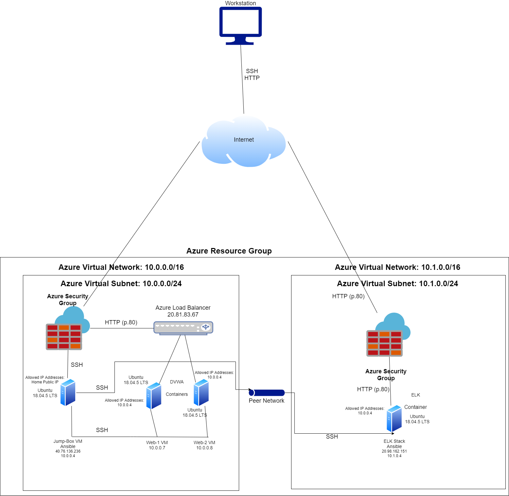
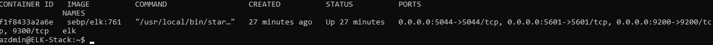

# CyberSecurityPortfolio
Portfolio of scripts, diagrams, and other files used and/or created during program

## Automated ELK Stack Deployment

The files in this repository were used to configure the network depicted below.

These files have been tested and used to generate a live ELK deployment on Azure. They can be used to either recreate the entire deployment pictured above. Alternatively, select portions of the [Filebeat YAML](Roles/filebeat-playbook.yml) file may be used to install only certain pieces of it, such as Filebeat.

This document contains the following details:
- Description of the Topologu
- Access Policies
- ELK Configuration
  - Beats in Use
  - Machines Being Monitored
- How to Use the Ansible Build

### Description of the Topology

The main purpose of this network is to expose a load-balanced and monitored instance of DVWA, the D*mn Vulnerable Web Application.

Load balancing ensures that the application will be highly available, in addition to restricting attacks to the network.

Integrating an ELK server allows users to easily monitor the vulnerable VMs for changes to the logs and system metrics.

The configuration details of each machine may be found below.

| Name     | Function    | IP Address | Operating System     |
|----------|-------------|------------|----------------------|
| Jump Box | Gateway     | 10.0.0.4   | Ubuntu Linux 18.04   |
| Web-1    | DVWA Host   | 10.0.0.7   | Ubuntu Linux 18.04   |
| Web-2    | DVWA Host   | 10.0.0.8   | Ubuntu Linux 18.04   |
| ELK Stack| Log Analysis| 10.1.0.4   | Ubuntu Linux 18.04   |

### Access Policies

The machines on the internal network are not exposed to the public Internet. 

Only the Load Balancer machine can accept connections from the Internet. Access to this machine is only allowed from the following IP addresses:
- _Home Public IP Address_

Machines within the network can only be accessed by the Jump-Box VM (10.0.0.4).

A summary of the access policies in place can be found in the table below.

| Name         | Publicly Accessible | Allowed IP Addresses        |
|--------------|---------------------|-----------------------------|
| Jump Box     | Yes/No              | Home Public IP              |
| Web-1        | No                  | 10.0.0.4                    |
| Web-2        | No                  | 10.0.0.4                    |
| ELK Stack    | Yes/No              | Home Public IP / 10.0.0.4   |
| Load Balancer| Yes                 | Home Public IP              |

### Elk Configuration

Ansible was used to automate configuration of the ELK machine. No configuration was performed manually, which is advantageous because... 
_The process is automated and we can confirm all machines are setup equally without a step being missed_

The playbook implements the following tasks: 
- _Install Docker_ 
- _Allow system to use more memory_ 
- _Download ELK container_ 
- _Start ELK container_ 
- _Make sure container starts on system boot/reboot_

The following screenshot displays the result of running `docker ps` after successfully configuring the ELK instance.

### Target Machines & Beats
This ELK server is configured to monitor the following machines: 
- _Web-1 (10.0.0.7)_ 
- _Web-2 (10.0.0.8)_ 

We have installed the following Beats on these machines: 
- _Filebeat_ 
- _Metricbeat_ 

These Beats allow us to collect the following information from each machine: 
- _Filebeat allows us to monitor log information, which we can use to observe and monitor important or relevant activity on the servers_ 
- _Metricbeat allows us to monitor metrics about our system resources, such as CPU, memory, and other important resources being used_ 

### Using the Playbook
In order to use the playbook, you will need to have an Ansible control node already configured. Assuming you have such a control node provisioned: 

SSH into the control node and follow the steps below:
- Copy the [ELK YAML Playbook](Roles/elk_setup.yml) file to your Roles folder.
- Update the YAML Playbook file to include your target host/s that you want to install ELK on.
- Run the playbook, and navigate to http://[your.ELK-VM.External.IP]:5601/app/kibana to check that the installation worked as expected.

